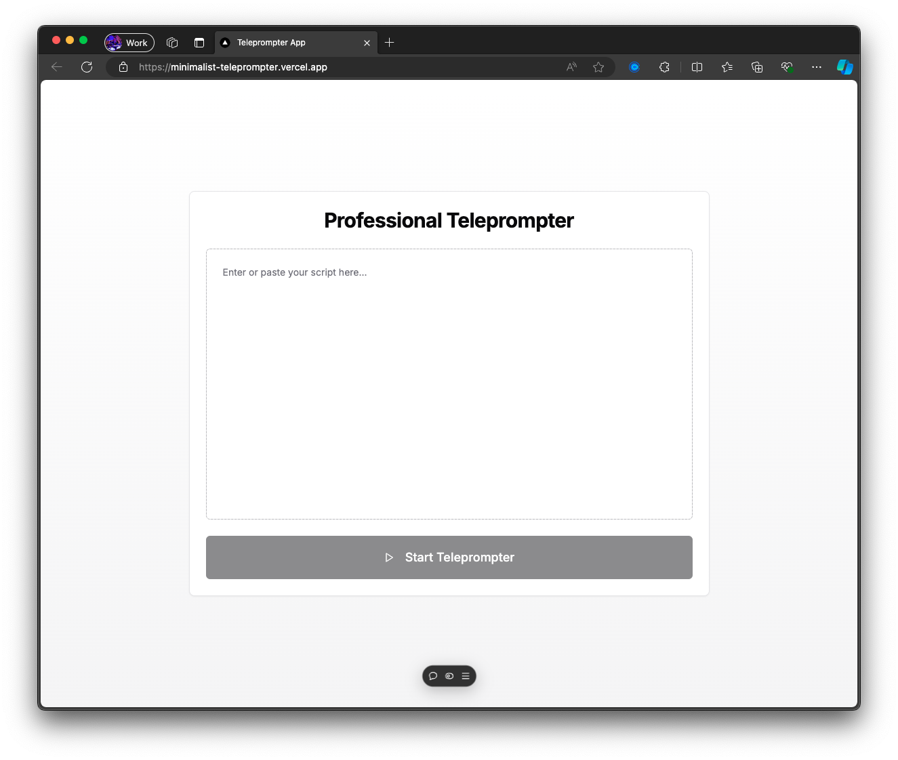
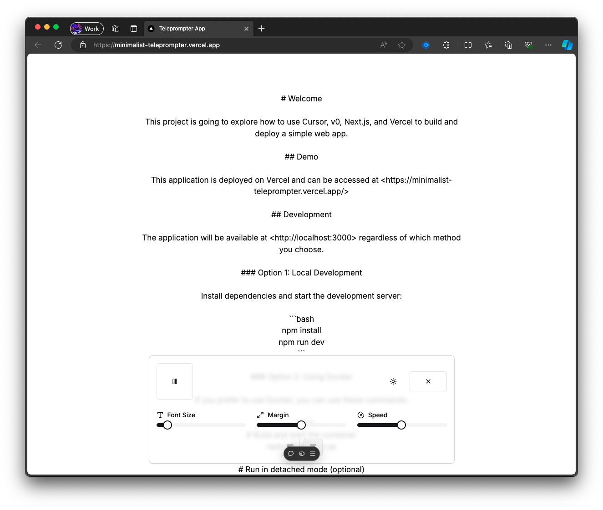

# Welcome

This project is going to explore how to use Cursor, v0, Next.js, and Vercel to build and deploy a simple web app.

## Demo

This application is deployed on Vercel and can be accessed at <https://minimalist-teleprompter.vercel.app/>





## Development

The application will be available at <http://localhost:3000> regardless of which method you choose.

### Option 1: Local Development

Install dependencies and start the development server:

```bash
# Navigate to the teleprompter app
cd apps/teleprompter

# Install dependencies
npm install

# Start the development server
npm run dev
```

### Option 2: Using Docker

If you prefer to use Docker, you can use these commands:

```bash
# Build and start the container
npm run docker:up

# Run in detached mode (optional)
npm run docker:up:detach

# Stop the container
npm run docker:down
```
